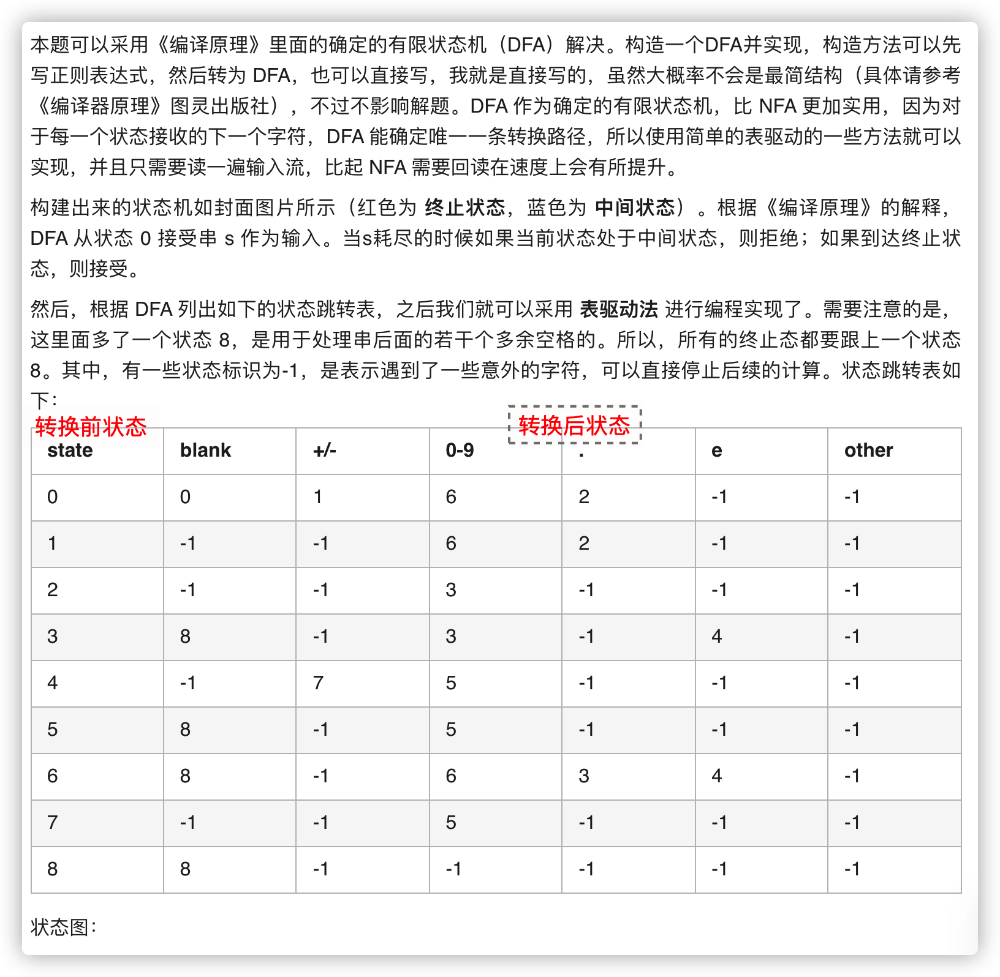
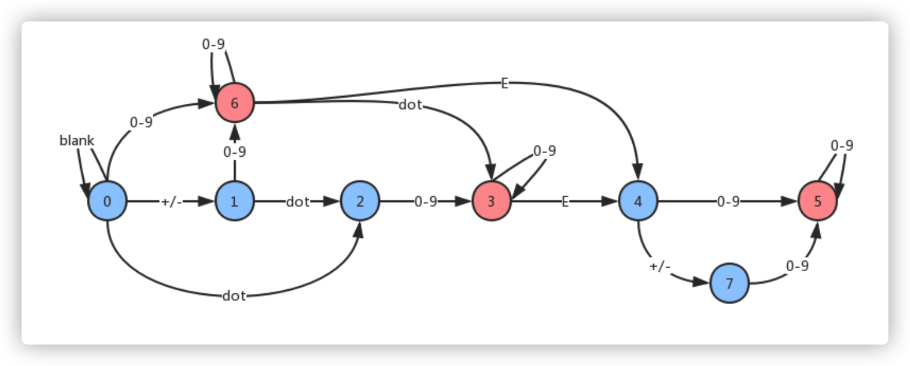

### 00065





## 代码

```java
class java00002.m01.Solution {
    public int make(char c) {
        switch(c) {
            case ' ': return 0;
            case '+':
            case '-': return 1;
            case '.': return 3;
            case 'e': return 4;
            default:
                if(c >= 48 && c <= 57) return 2;
        }
        return -1;
    }
    
    public boolean isNumber(String s) {
        int state = 0;
        int finals = 0b101101000;
        int[][] transfer = new int[][]{{ 0, 1, 6, 2,-1},
                                       {-1,-1, 6, 2,-1},
                                       {-1,-1, 3,-1,-1},
                                       { 8,-1, 3,-1, 4},
                                       {-1, 7, 5,-1,-1},
                                       { 8,-1, 5,-1,-1},
                                       { 8,-1, 6, 3, 4},
                                       {-1,-1, 5,-1,-1},
                                       { 8,-1,-1,-1,-1}};
        char[] ss = s.toCharArray();
        for(int i=0; i < ss.length; ++i) {
            int id = make(ss[i]);
            if (id < 0) return false;
            state = transfer[state][id];
            if (state < 0) return false;
        }
        return (finals & (1 << state)) > 0;
    }
}
```

