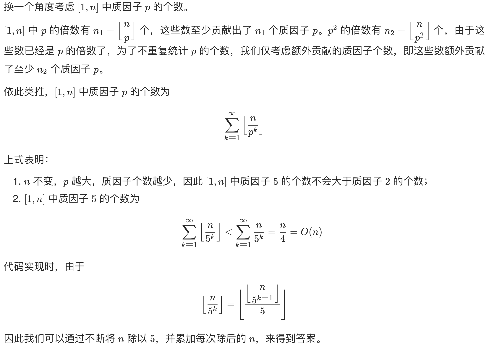

# 172. 阶乘后的零

给定一个整数 n ，返回 n! 结果中尾随零的数量。

提示 n! = n * (n - 1) * (n - 2) * ... * 3 * 2 * 1

 

示例 1：

输入：n = 3
输出：0
解释：3! = 6 ，不含尾随 0
示例 2：

输入：n = 5
输出：1
解释：5! = 120 ，有一个尾随 0
示例 3：

输入：n = 0
输出：0


提示：

$0 <= n <= 10^4$


&nbsp;

## 阶乘

> 阶乘后除 10

[m01](java00172/m01/Solution.java)

&nbsp;

## 数学

n! 尾零的数量即为 n! 中因子 10 的个数，而 10=2×5，因此转换成求 n! 中质因子 2 的个数和质因子 5 的个数的较小值。

由于质因子 5的个数不会大于质因子 2 的个数（具体证明见方法二），我们可以仅考虑质因子 5 的个数。

而 n! 中质因子 5 的个数等于 [1,n] 的每个数的质因子 5 的个数之和，我们可以通过遍历 [1,n] 的所有 5 的倍数求出。

```java
class Solution {
    public int trailingZeroes(int n) {

        int res = 0;

        for (int i = 5; i < n + 1; i += 5) {
            int temp = i;
            while (temp % 5 == 0) {
                res++;
                temp /= 5;
            }
        }

        return res;
    }
}
```

```java
class Solution {
    public int trailingZeroes(int n) {

        int res = 0;

        for (int i = 5; i < n + 1; i += 5) {
            int power5 = 5;
            while (i % power5 == 0) {
                res++;
                power5 *= 5;
            }
        }

        return res;
    }
}
```

- 时间复杂度：O(n)。n! 中因子 5 的个数为 O(n)
- 空间复杂度：O(1)。

&nbsp;

## 优化



```java
class Solution {
    public int trailingZeroes(int n) {

        int res = 0;
        int power5 = 5;
        while (n >= power5) {
            res += n / power5;
            power5 *= 5;
        }

        return res;
    }
}
```

&nbsp;

```java
class Solution {
    public int trailingZeroes(int n) {
        
        int res = 0;

        while (n > 0) {
            n /= 5;
            res += n;
        }

        return res;
    }
}
```

