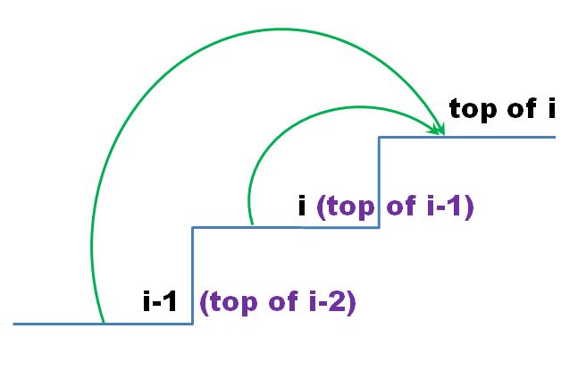

## 746. 使用最小花费爬楼梯

&nbsp;

题目要求的是到达第 n 级台阶楼层顶部的最小花费，可以用动态规划来解，下面一步一步来讲怎样确定状态空间、怎样给出状态转移方程。

理解题意需要注意两点：

第i级台阶是第i-1级台阶的阶梯顶部。

踏上第i级台阶花费cost[i]，直接迈一大步跨过而不踏上去则不用花费。

&nbsp;

### 解法一：



到达第i级台阶的阶梯顶部的最小花费，有两个选择：

先付出最小总花费 `minCost[i-1]` 到达第i级台阶（即第i-1级台阶的阶梯顶部），踏上第i级台阶需要再花费cost[i]，再迈一步到达第i级台阶的阶梯顶部，最小总花费为 `minCost[i-1] + cost[i])`；

先付出最小总花费 `minCost[i-2]` 到达第i-1级台阶（即第i-2级台阶的阶梯顶部），踏上第i-1级台阶需要再花费cost[i-1]，再迈两步跨过第i级台阶直接到达第i级台阶的阶梯顶部，最小总花费为minCost[i-2] + cost[i-1])；

则minCost[i]是上面这两个最小总花费中的最小值。

`minCost[i] = min(minCost[i-1] + cost[i], minCost[i-2] + cost[i-1])`。

台阶的数组从0开始计数。可以用-1代表地面，并设 `cost[-1] = 0`。

最小总花费的初始值为：

第0级台阶： `minCost[0] = min(cost[-1], cost[0]) = min(0, cost[0]) = 0`，

第1级台阶： `minCost[1] = min(cost[0], cost[1])`。

动态递归代码如下：

```java
class java00002.m01.Solution {
    public int minCostClimbingStairs(int[] cost) {
        int size = cost.length;
        int[] minCost = new int[size];
        minCost[0] = 0;
        minCost[1] = Math.min(cost[0], cost[1]);
        for (int i = 2; i < size; i++) {
            minCost[i] = Math.min(minCost[i - 1] + cost[i], minCost[i - 2] + cost[i - 1]);
        }
        return minCost[size - 1];
    }
}
```

&nbsp;

上面的代码在空间利用上可以再优化一下。只用两个变量保存状态转移方程中前面的两个记录，并不断更新，就可以递推下去，这样空间复杂度就由O(N)变为O(1)了。

代码如下：

```java
class java00002.m01.Solution {
    public int minCostClimbingStairs(int[] cost) {
        int minCost0 = 0;
        int minCost1 = Math.min(cost[0], cost[1]);
        int minCost = 0;
        for (int i = 2; i < cost.length; i++) {
            minCost = Math.min(minCost1 + cost[i], minCost0 + cost[i - 1]);
            minCost0 = minCost1;
            minCost1 = minCost;
        }
        return minCost;
    }
};
```

&nbsp;

### 解法二：

到达第i级台阶的阶梯顶部的最小花费，有两个选择：

最后踏上了第i级台阶，最小花费dp[i]，再迈一步到达第i级台阶楼层顶部；
最后踏上了第i-1级台阶，最小花费dp[i-1]，再迈两步跨过第i级台阶直接到达第i级台阶的阶梯顶部。

所以到达第i级台阶的阶梯顶部的最小花费为minCost[i] = min(dp[i], dp[i-1])。

即为了求出到达第i级台阶的阶梯顶部的最小花费，我们先算出踏上第i级台阶的最小花费，用dp[i]表示，再通过min(dp[i], dp[i-1])来求出到达第i级台阶的阶梯顶部的最小花费。


踏上第i级台阶有两种方法：

先踏上第i-2级台阶（最小总花费 `dp[i-2]`），再直接迈两步踏上第i级台阶（花费cost[i]），最小总花费 `dp[i-2] + cost[i]`；

先踏上第i-1级台阶（最小总花费 `dp[i-1]`），再迈一步踏上第i级台阶（花费cost[i]），最小总花费 `dp[i-1] + cost[i]`

则dp[i]是上面这两个最小总花费中的最小值。

因此状态转移方程是：

`dp[i] = min(dp[i-2], dp[i-1]) + cost[i]`

初始条件：

最后一步踏上第0级台阶，最小花费 `dp[0] = cost[0]`。

最后一步踏上第1级台阶有两个选择：

可以分别踏上第0级与第1级台阶，花费 `cost[0] + cost[1]`；
也可以从地面开始迈两步直接踏上第1级台阶，花费cost[1]。
最小值 `dp[1] = min(cost[0] + cost[1], cost[1]) = cost[1]`。

&nbsp;

以下是代码：

```java
class java00002.m01.Solution {
    public int minCostClimbingStairs(int[] cost) {
        int[] dp = new int[cost.length];
        dp[0] = cost[0];
        dp[1] = cost[1];
        for (int i = 2; i < cost.length; i++) {
            dp[i] = Math.min(dp[i - 2], dp[i - 1]) + cost[i];
        }
        return Math.min(dp[cost.length - 2], dp[cost.length - 1]);
    }
}
```

&nbsp;

上面的代码在空间利用上可以再优化一下。

注意到状态转移方程中只用到了前面的两个记录，可以不用一维数组，只用两个变量保存前面的两个记录，并不断更新，就可以递推下去，这样空间复杂度就是O(1)了。

更进一步，注意到初始值 `dp[0] = cost[0]，dp[1] = cost[1]`，可以直接复用cost数组来代表dp数组。

代码如下：

```java
class java00002.m01.Solution {
    public int minCostClimbingStairs(int[] cost) {
        for (int i = 2; i < cost.length; i++) {
            cost[i] = Math.min(cost[i - 2], cost[i - 1]) + cost[i];
        }
        return Math.min(cost[cost.length - 2], cost[cost.length - 1]);
    }
}
```

&nbsp;

这两种解法的关系：

到达第i级台阶的阶梯顶部的最小花费等于踏上第i级台阶的最小花费与踏上第i-1级台阶的最小花费的最小值：

`minCost[i] = min(dp[i], dp[i-1])`

将dp[i]的状态转移方程 `dp[i] = min(dp[i-1], dp[i-2]) + cost[i]` 代入：

`minCost[i] = min(dp[i-1], dp[i])
           = min(min(dp[i-1], dp[i-2]) + cost[i], min(dp[i-2], dp[i-3]) + cost[i-1])
           = min(minCost[i-1] + cost[i], minCost[i-2] + cost[i-1])`
这样我们就得到了minCost[i]的状态转移方程。

`minCost[i]` 与 `dp[i]` 的关系，还满足 `minCost[i] = dp[i+1] - cost[i+1]`。