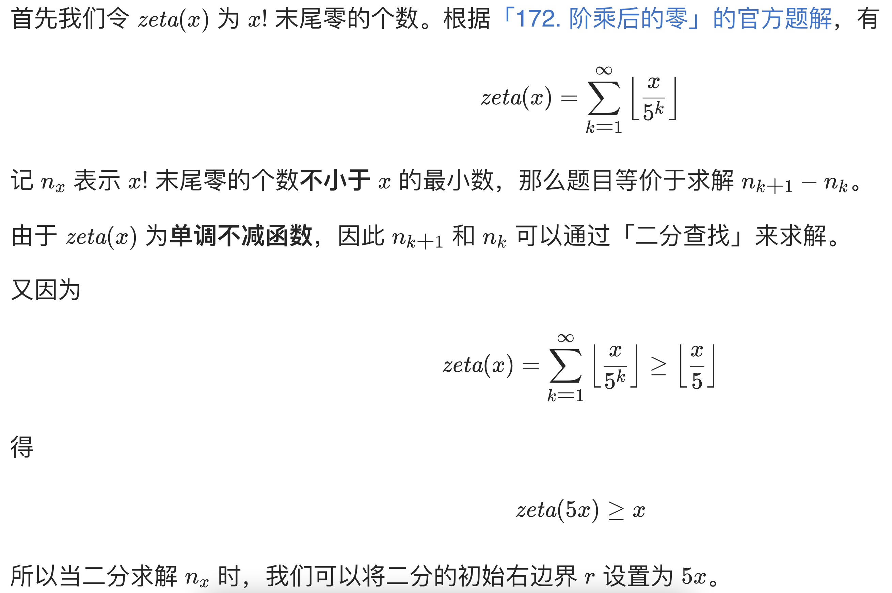

# 793. 阶乘函数后 K 个零

## 题目

 f(x) 是 x! 末尾是 0 的数量。回想一下 x! = 1 * 2 * 3 * ... * x，且 0! = 1 。

例如， f(3) = 0 ，因为 3! = 6 的末尾没有 0 ；而 f(11) = 2 ，因为 11!= 39916800 末端有 2 个 0 。
给定 k，找出返回能满足 f(x) = k 的非负整数 x 的数量。

示例 1：

输入：k = 0
输出：5
解释：0!, 1!, 2!, 3!, 和 4! 均符合 k = 0 的条件。
示例 2：

输入：k = 5
输出：0
解释：没有匹配到这样的 x!，符合 k = 5 的条件。
示例 3:

输入: k = 3
输出: 5


提示:

$0 <= k <= 10^9$

&nbsp;

## 思路



&nbsp;

## 二分法

```java
class Solution {
    public int preimageSizeFZF(int k) {
        return (int) (f(k + 1) - f(k));
    }

    public long f(int k) {
        
        // 初始化 r 为 5k
        long r = 5L * k;
        long l = 0;
        
        // 开始二分找到等于 k 的数
        while (l <= r) {
            
            long mid = (r + l) / 2;
            if (zeroCount(mid) < k) {
                l = mid + 1;
            } else {
                r = mid - 1;
            }
        }
        
        return r + 1;
    }

    /**
     * x 阶乘， 结尾 0 的个数
     */
    public long zeroCount(long x) {
        long res = 0;
        while (x != 0) {
            res += x / 5;
            x /= 5;
        }
        return res;
    }
}
```


&nbsp;

