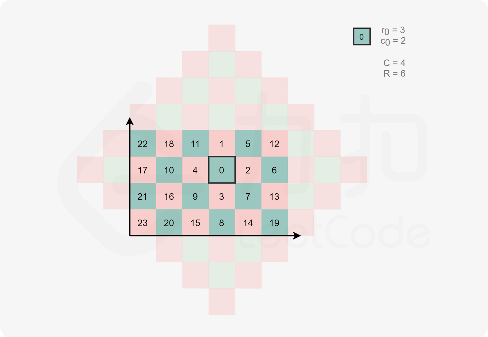

## 距离顺序排列矩阵单元格

### 方法一：直接排序

**思路及解法**

最容易想到的方法是首先存储矩阵内所有的点，然后将其按照哈曼顿距离直接排序。

**代码**

- Java

```java
class java00002.m01.Solution {

    public int[][] allCellsDistOrder(int R, int C, int r0, int c0) {

        int[][] res = new int[R * C][];

        for (int i = 0; i < R; i++) {
            for (int j = 0; j < C; j++) {
                res[i * C + j] = new int[]{i, j};
            }
        }

        Arrays.sort(res,
                (o1, o2) -> (Math.abs(o1[0] - r0) + Math.abs(o1[1] - c0)) - (Math.abs(o2[0] - r0) + Math.abs(o2[1] - c0))
        );


        return res;
    }
}
```

&nbsp;

- C++

```c++
class java00002.m01.Solution {
public:
    vector<vector<int>> allCellsDistOrder(int R, int C, int r0, int c0) {
        vector<vector<int>> ret;
        for (int i = 0; i < R; i++) {
            for (int j = 0; j < C; j++) {
                ret.push_back({i, j});
            }
        }
        sort(ret.begin(), ret.end(), [=](vector<int>& a, vector<int>& b) {
            return abs(a[0] - r0) + abs(a[1] - c0) < abs(b[0] - r0) + abs(b[1] - c0);
        });
        return ret;
    }
};
```

&nbsp;

复杂度分析

时间复杂度：`O(RClog(RC))`，存储所有点时间复杂度O(RC)，排序时间复杂度 O(RClog(RC))。

空间复杂度：`O(log(RC))`，即为排序需要使用的栈空间，不考虑返回值的空间占用。

&nbsp;

### 方法二：桶排序

**思路及解法**

注意到方法一中排序的时间复杂度太高。实际在枚举所有点时，我们可以直接按照哈曼顿距离分桶。这样我们就可以实现线性的桶排序。

```java
class java00002.m01.Solution {
    public int[][] allCellsDistOrder(int R, int C, int r0, int c0) {
        int maxDist = Math.max(r0, R - 1 - r0) + Math.max(c0, C - 1 - c0);
        List<List<int[]>> bucket = new ArrayList<List<int[]>>();
        for (int i = 0; i <= maxDist; i++) {
            bucket.add(new ArrayList<int[]>());
        }

        for (int i = 0; i < R; i++) {
            for (int j = 0; j < C; j++) {
                int d = dist(i, j, r0, c0);
                bucket.get(d).add(new int[]{i, j});
            }
        }
        int[][] ret = new int[R * C][];
        int index = 0;
        for (int i = 0; i <= maxDist; i++) {
            for (int[] it : bucket.get(i)) {
                ret[index++] = it;
            }
        }
        return ret;
    }

    public int dist(int r1, int c1, int r2, int c2) {
        return Math.abs(r1 - r2) + Math.abs(c1 - c2);
    }
}
```

&nbsp;

```c++
class java00002.m01.Solution {
public:
    int dist(int r1, int c1, int r2, int c2) {
        return abs(r1 - r2) + abs(c1 - c2);
    }

    vector<vector<int>> allCellsDistOrder(int R, int C, int r0, int c0) {
        int maxDist = max(r0, R - 1 - r0) + max(c0, C - 1 - c0);
        vector<vector<vector<int>>> bucket(maxDist + 1);

        for (int i = 0; i < R; i++) {
            for (int j = 0; j < C; j++) {
                int d = dist(i, j, r0, c0);
                vector<int> tmp = {i, j};
                bucket[d].push_back(move(tmp));
            }
        }
        vector<vector<int>> ret;
        for (int i = 0; i <= maxDist; i++) {
            for (auto &it : bucket[i]) {
                ret.push_back(it);
            }
        }
        return ret;
    }
};
```

&nbsp;

复杂度分析：

时间复杂度：O(RC)，存储所有点时间复杂度 O(RC)，桶排序时间复杂度 O(RC)。

空间复杂度：O(RC)，需要存储矩阵内所有点。

&nbsp;

方法三：几何法
思路及解法

我们也可以直接变换枚举矩阵的顺序，直接按照曼哈顿距离遍历该矩形即可。

注意到曼哈顿距离相同的位置恰好构成一个斜着的正方形边框，因此我们可以从小到大枚举曼哈顿距离，并使用循环来直接枚举该距离对应的边框。我们每次从该正方形边框的上顶点出发，依次经过右顶点、下顶点和左顶点，最后回到上顶点。这样即可完成当前层的遍历。




注意正方形边框中的部分点不一定落在矩阵中，所以我们需要做好边界判断。

- C++

```c++
class java00002.m01.Solution {
public:
    const int dr[4] = {1, 1, -1, -1};
    const int dc[4] = {1, -1, -1, 1};

    vector<vector<int>> allCellsDistOrder(int R, int C, int r0, int c0) {
        int maxDist = max(r0, R - 1 - r0) + max(c0, C - 1 - c0);
        vector<vector<int>> ret;
        int row = r0, col = c0;
        ret.push_back({row, col});
        for (int dist = 1; dist <= maxDist; dist++) {
            row--;
            for (int i = 0; i < 4; i++) {
                while ((i % 2 == 0 && row != r0) || (i % 2 != 0 && col != c0)) {
                    if (row >= 0 && row < R && col >= 0 && col < C) {
                        ret.push_back({row, col});
                    }
                    row += dr[i];
                    col += dc[i];
                }
            }
        }
        return ret;
    }
};
```

&nbsp;

- Java

```java
class java00002.m01.Solution {
    int[] dr = {1, 1, -1, -1};
    int[] dc = {1, -1, -1, 1};

    public int[][] allCellsDistOrder(int R, int C, int r0, int c0) {
        int maxDist = Math.max(r0, R - 1 - r0) + Math.max(c0, C - 1 - c0);
        int[][] ret = new int[R * C][];
        int row = r0, col = c0;
        int index = 0;
        ret[index++] = new int[]{row, col};
        for (int dist = 1; dist <= maxDist; dist++) {
            row--;
            for (int i = 0; i < 4; i++) {
                while ((i % 2 == 0 && row != r0) || (i % 2 != 0 && col != c0)) {
                    if (row >= 0 && row < R && col >= 0 && col < C) {
                        ret[index++] = new int[]{row, col};
                    }
                    row += dr[i];
                    col += dc[i];
                }
            }
        }
        return ret;
    }
}
```

&nbsp;

复杂度分析

时间复杂度：$O((R+C) ^2)$，我们需要遍历矩阵内所有点，同时也会遍历部分超过矩阵部分的点。在最坏情况下，给定的单元格位于矩阵的一个角，例如 (0,0)，此时最大的曼哈顿距离为 R+C−2，需要遍历的点数为 2(*R*+*C*−2)(*R*+*C*−1)+1，因此时间复杂度为 $O((R+C)^2)$

空间复杂度：$O(1)$，不考虑返回值的空间占用。
