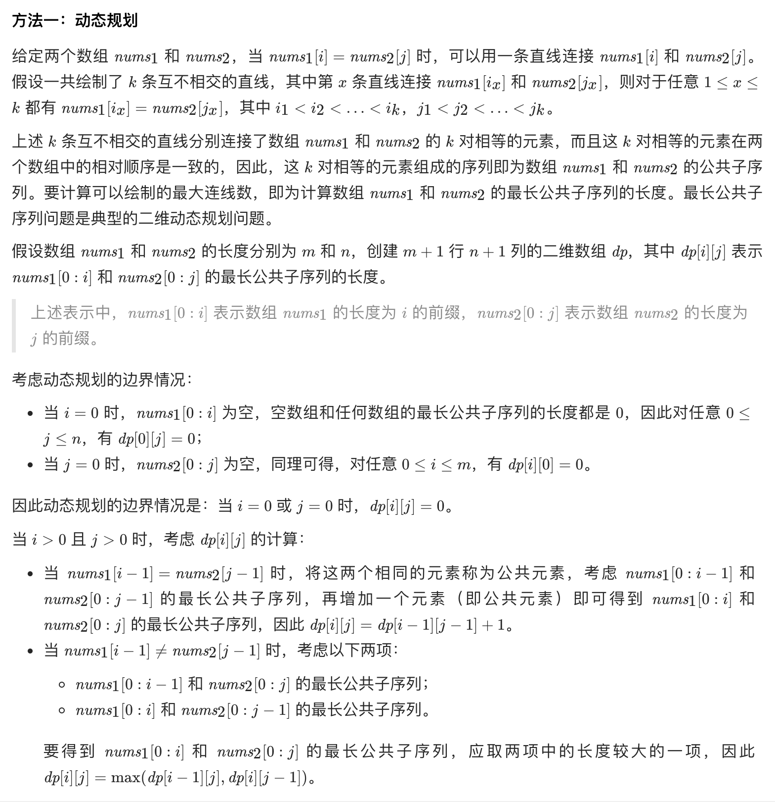
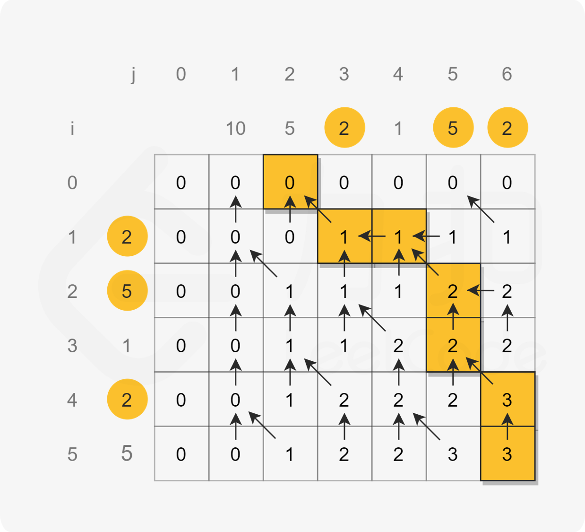

## 01035 . 不相交的线

&nbsp;



&nbsp;


&nbsp;



&nbsp;

```java
class java00002.m01.Solution {
    public int maxUncrossedLines(int[] nums1, int[] nums2) {
        int m = nums1.length, n = nums2.length;
        int[][] dp = new int[m + 1][n + 1];
        for (int i = 1; i <= m; i++) {
            int num1 = nums1[i - 1];
            for (int j = 1; j <= n; j++) {
                int num2 = nums2[j - 1];
                if (num1 == num2) {
                    dp[i][j] = dp[i - 1][j - 1] + 1;
                } else {
                    dp[i][j] = Math.max(dp[i - 1][j], dp[i][j - 1]);
                }
            }
        }
        return dp[m][n];
    }
}
```

&nbsp;

复杂度分析

时间复杂度：O(mn)，其中 m 和 n 分别是数组 nums1 和 nums2的长度。二维数组 dp 有 m+1 行 和 n+1 列，需要对 dp 中的每个元素进行计算。

空间复杂度：O(mn)，其中 m 和 n 分别是数组 nums1 和 nums2的长度。创建了 m+1 行 n+1 列的二维数组 dp。