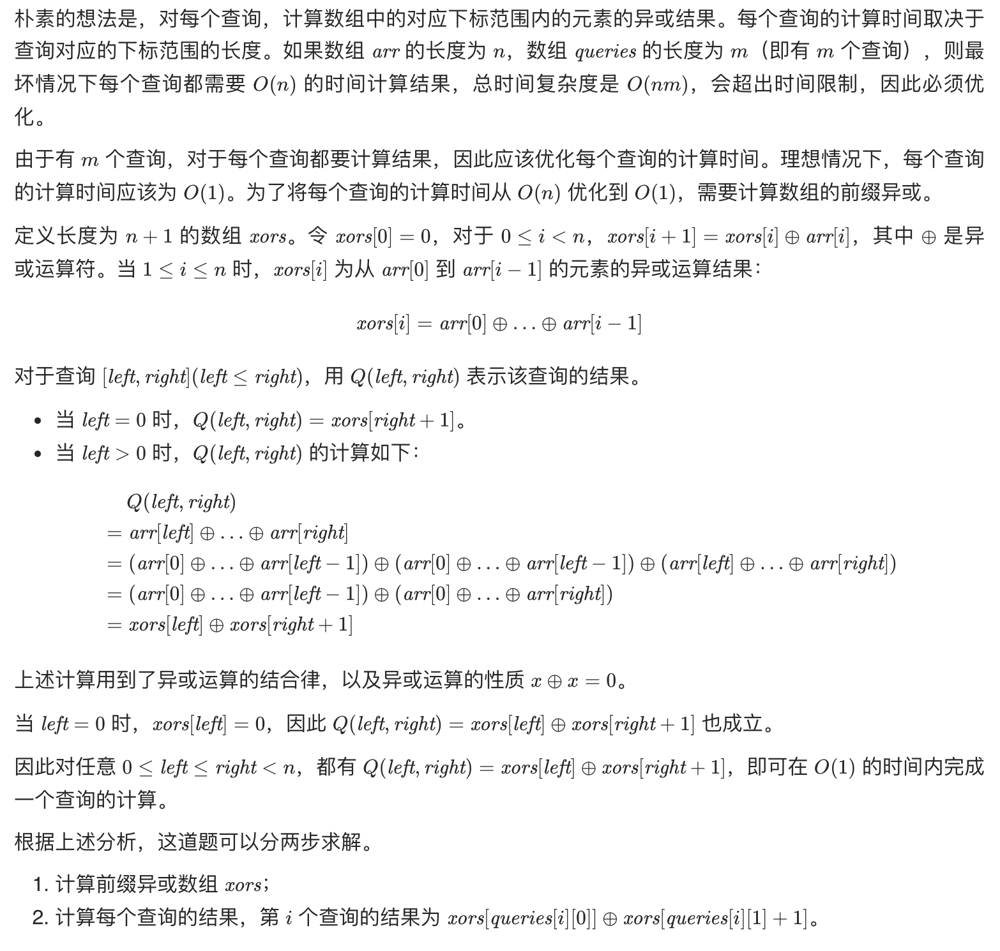
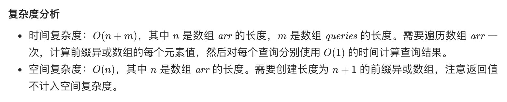

### 子数组异或查询




- Java

```java
class Solution {
    public int[] xorQueries(int[] arr, int[][] queries) {
        int n = arr.length;
        int[] xors = new int[n + 1];
        for (int i = 0; i < n; i++) {
            xors[i + 1] = xors[i] ^ arr[i];
        }
        int m = queries.length;
        int[] ans = new int[m];
        for (int i = 0; i < m; i++) {
            ans[i] = xors[queries[i][0]] ^ xors[queries[i][1] + 1];
        }
        return ans;
    }
}
```

&nbsp;

- C++

```java
class Solution {
public:
    vector<int> xorQueries(vector<int>& arr, vector<vector<int>>& queries) {
        int n = arr.size();
        vector<int> xors(n + 1);
        for (int i = 0; i < n; i++) {
            xors[i + 1] = xors[i] ^ arr[i];
        }
        int m = queries.size();
        vector<int> ans(m);
        for (int i = 0; i < m; i++) {
            ans[i] = xors[queries[i][0]] ^ xors[queries[i][1] + 1];
        }
        return ans;
    }
};
```

