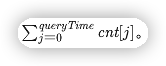

# 在既定时间做作业的学生人数

## 方法一：枚举

题目要求找到 queryTime 时正在做作业的学生人数，第 i 名学生的起始时间 startTime*[*i*] 和完成时间 *endTime*[*i*] 

如果满足 startTime*[*i*]≤*queryTime*≤*endTime*[*i]，则可知该名学生在 *queryTime* 时一定正在作业。我们遍历所有学生的起始时间和结束时间，统计符合上述条件的学生总数即可。

```java
class Solution {
    public int busyStudent(int[] startTime, int[] endTime, int queryTime) {
        int n = startTime.length;
        int ans = 0;
        for (int i = 0; i < n; i++) {
            if (startTime[i] <= queryTime && endTime[i] >= queryTime) {
                ans++;
            }
        }
        return ans;
    }
}
```

**复杂度分析**

- 时间复杂度：O*(*n)，其中 n 为 数组的长度。只需遍历一遍数组即可。
- 空间复杂度：*O*(1)。

&nbsp;

## 方法二：差分数组

利用差分数组的思想，对差分数组求前缀和，可以得到统计出 *t* 时刻正在做作业的人数。我们初始化差分数组 cnt 每个元素都为 0，在每个学生的起始时间处 cnt[*startTime*[*i*]] 加 1，在每个学生的结束时间处 cnt*[*endTime*[*i]+1] 减 1，因此我们可以统计出 *queryTime* 时刻正在做作业的人数为 



```java
class Solution {
    public int busyStudent(int[] startTime, int[] endTime, int queryTime) {
      
      // 求出学生人数
        int len = startTime.length;
      
      // 最大结束时间
        int maxEndTime = Arrays.stream(endTime).max().getAsInt();
      
      // 边界条件， queryTime 大于最大结束时间，说明 queryTime 在所有学生都结束写作业后
      // 一切没有意义， 没有一个学生在写作业
        if (queryTime > maxEndTime) {
            return 0;
        }
      
      // 定义差分数组 cnt
        int[] cnt = new int[maxEndTime + 2];
      
      // 差分数组赋值
        for (int i = 0; i < len; i++) {
            cnt[startTime[i]]++;
            cnt[endTime[i] + 1]--;
        }
      
      
      // 
        int res = 0;
        for (int i = 0; i <= queryTime; i++) {
            res += cnt[i];
        }
        return res;
    }
}
```

**复杂度分析**

- 时间复杂度：O(*n*+*queryTime*)，其中 n*n* 为数组的长度，queryTime 为给定的查找时间。首先需要遍历一遍数组，需要的时间为 O*(*n)，然后需要查分求和求出 *queryTime* 时间点正在作业的学生总数，需要的时间为 O*(*queryTime)，因此总的时间为 O(n+queryTime)。
- 空间复杂度：O*(max(*endTime + 2))。

&nbsp;

## 方法三：二分查找

对于每个学生的作业时间  [startTime}[i], endTime}[i]] ，一定满足 startTime[i] ≤ endTime[i]。

如果第  i 名学生在 queryTime 时正在作业，则一定满足 startTime[i] ≤ *queryTime* ≤ endTime[i]。

设起始时间小于等于 queryTime 的学生集合为 lessStart*，设结束时间小于 queryTime 的学生集合为 lessEnd，则根据上述推理可以知道 lessEnd*∈*lessStart*，我们从 lessStart 去除 lessEnd 的子集部分即为符合条件的学生集合。因此我们通过二分查找找到始时间小于等于 queryTime 的学生人数，然后减去结束时间小于 queryTime 的学生人数，最终结果即为符合条件要求。

```java
class Solution:
    def busyStudent(self, startTime: List[int], endTime: List[int], queryTime: int) -> int:
        startTime.sort()
        endTime.sort()
        return bisect_right(startTime, queryTime) - bisect_left(endTime, queryTime)
```

&nbsp;

**复杂度分析**

- 时间复杂度：O*(*nlogn)，其中 *n* 为 数组的长度。排序需要的时间为 O*(*n*log*n*)，二分查找的时间复杂度为O*(log*n*)。
- 空间复杂度：O(logn)。排序需要的栈空间为 O*(log*n*)。